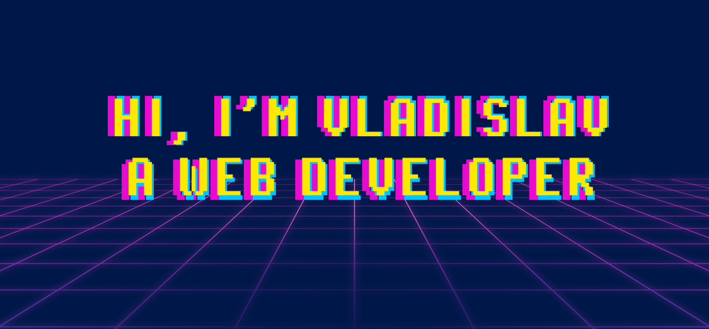

<body>
  

    
  

  <h1>ʟᴀɴɢᴜᴀɢᴇꜱ ᴀɴᴅ ᴛᴏᴏʟꜱ </h1>
  

    
    
    
    
    
    
    
    
    
    
    
    
    
    
    
    
    
    
    
    
    
    
  

  

    <h4>I've been working for the last time:</h4>
    
    
    
  

  <h1>ᴀʙᴏᴜᴛ ᴍᴇ :space_invader:</h1>
  <ul>
    <li>I'm 21</li>
    <li>I'm live in Rissia (Novocherkask, Rostov region).</li>
    <li>I've been learning JavaScript and Web-development for about a couple of years.</li>
    <li>I'm graduating from Platov South-Russian State Polytechnic University.</li>
    <li>I'm trying to improve my English</li>
    <li>Interested in computer networks and linux</li>
    <li>Keep learning and gain experience ∞</li>
  </ul>    
  
  |  |  |
| ------------- | ------------- |
  
  <h1>ɪᴍᴍᴇᴅɪᴀᴛᴇ ᴏʙᴊᴇᴄᴛɪᴠᴇꜱ :dart:</h1>
  <ul>
    <li>Improve knowledge about computer networks</li>
    <li>Fluency in English B1 level</li>
    <li>ᴡᴏʀᴋ → ʟᴇᴀʀɴɪɴɢ → ᴄᴏᴅɪɴɢ → ʀᴇᴘᴇᴀᴛ ⟲</li>
  </ul>
  
  

</body>
